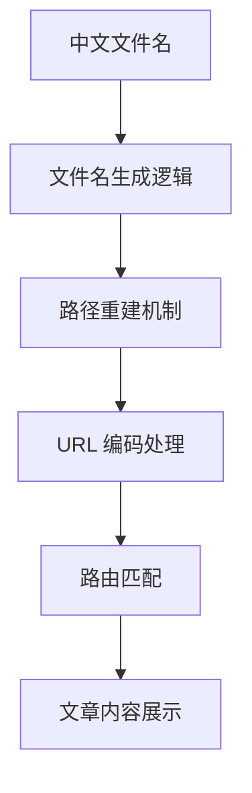

# Nuxt 3 博客系统中文路径支持技术指南

本文档详细说明了如何在基于 Nuxt 3 + Nuxt Content 的博客系统中实现中文文件名和路径的完整支持。

## 🎯 问题背景

在使用 Nuxt Content 处理中文文件名时，常见的问题包括：

1. **路径生成错误**: 中文文件名 `新建文章测试.md` 的路径被错误生成为 `/blog` 而不是 `/blog/新建文章测试`
2. **URL 编码问题**: 浏览器和服务器对中文 URL 的编码/解码处理不一致
3. **路由匹配失败**: 动态路由无法正确匹配中文路径参数

## 🔧 解决方案架构

### 1. 核心处理流程



### 2. 关键组件

- **文件名生成**: `pages/admin.vue` - 智能处理中文文件名
- **路径重建**: `components/ContentCard.vue` - 修复错误的路径
- **路由处理**: `pages/blog/[...slug].vue` - 多重查询策略

## 📝 实现细节

### 1. 文件名生成逻辑

在管理后台创建文章时，智能处理中文标题：

```javascript
// pages/admin.vue
if (!filename) {
  let baseFilename = articleForm.value.title.trim()
  
  // 检测是否包含中文字符
  if (/[\u4e00-\u9fff]/.test(baseFilename)) {
    // 中文文件名处理
    baseFilename = baseFilename
      .replace(/\s+/g, '-')                    // 空格转连字符
      .replace(/[<>:"/\\|?*]/g, '')           // 移除文件系统不允许的字符
      .replace(/\.+$/g, '')                   // 移除结尾的点
      .replace(/^-+|-+$/g, '')                // 移除开头和结尾的连字符
      .substring(0, 50)                       // 中文文件名限制更短
  } else {
    // 英文文件名处理
    baseFilename = baseFilename
      .toLowerCase()
      .replace(/\s+/g, '-')
      .replace(/[^a-z0-9-]/g, '')
      .replace(/^-+|-+$/g, '')
      .substring(0, 100)
  }
  
  // 如果处理后的文件名为空，使用默认名称
  if (!baseFilename) {
    baseFilename = `article-${Date.now()}`
  }
  
  filename = `${baseFilename}.md`
}
```

### 2. 路径重建机制

当 Nuxt Content 生成错误路径时，从其他字段重建正确路径：

```javascript
// components/ContentCard.vue
const getArticlePath = (content) => {
    let path = content.path || content._path
    
    // 如果路径不正确（比如只是 /blog），从 stem 重建路径
    if (!path || path === '/blog') {
        if (content.stem) {
            // 从 stem 重建路径: 'blog/新建文章测试' -> '/blog/新建文章测试'
            path = '/' + content.stem
        }
    }
    
    // 确保中文路径正确编码
    return path ? encodeURI(path) : '#'
}
```

### 3. 多重查询策略

在文章详情页面实现容错的查询机制：

```javascript
// pages/blog/[...slug].vue
const { data: article, pending } = await useAsyncData(`article-${articlePath}`, async () => {
    // 首先尝试按路径查询
    let result = await queryCollection('blog').path(articlePath).first()
    
    // 如果按路径查询失败，尝试按文件名查询（处理中文文件名问题）
    if (!result && slug) {
        const filename = Array.isArray(slug) ? slug[slug.length - 1] : slug
        const decodedFilename = decodeURIComponent(filename)
        
        const allArticles = await queryCollection('blog').all()
        result = allArticles.find(article => {
            const articleFilename = article.stem?.split('/').pop()
            return articleFilename === decodedFilename || article.title === decodedFilename
        })
    }
    
    return result || null
})
```

## ⚙️ 配置要求

### 1. Nuxt 配置

```javascript
// nuxt.config.ts
export default defineNuxtConfig({
  content: {
    markdown: {
      anchorLinks: false  // 避免中文锚点问题
    },
    highlight: {
      theme: {
        default: 'github-light',
        dark: 'github-dark'
      }
    }
  }
})
```

### 2. 构建配置

```javascript
// nuxt.config.ts
nitro: {
  prerender: {
    crawlLinks: true,
    ignore: ['/admin', '/editor']  // 忽略管理页面
  }
}
```

## 🧪 测试用例

### 1. 文件名生成测试

| 输入标题 | 生成文件名 | 说明 |
|---------|-----------|------|
| `"Vue 3 技术指南"` | `Vue-3-技术指南.md` | 保留中文，空格转连字符 |
| `"React 组件设计模式"` | `React-组件设计模式.md` | 中英文混合 |
| `"文件名<>:"/\\|?*测试"` | `文件名测试.md` | 移除非法字符 |
| `""` (空标题) | `article-1642123456789.md` | 默认名称 |

### 2. 路径处理测试

```javascript
// 测试数据
const testContent = {
  title: '新建文章测试',
  path: '/blog',  // 错误的路径
  stem: 'blog/新建文章测试'  // 正确的 stem
}

// 期望结果
const expectedPath = '/blog/新建文章测试'
const actualPath = getArticlePath(testContent)
console.assert(decodeURI(actualPath) === expectedPath)
```

## 🚀 部署注意事项

### 1. 静态生成

中文文件名在静态生成时能正常工作：

```bash
npm run build  # 或 npx nuxt generate
```

### 2. 服务器环境

确保服务器支持 UTF-8 编码：

- **Nginx**: 设置 `charset utf-8;`
- **Apache**: 设置 `AddDefaultCharset UTF-8`
- **GitHub Pages**: 自动支持 UTF-8

## 📊 性能影响

### 1. 查询性能

- **主查询**: 按路径查询，性能最优
- **备用查询**: 按文件名查询，仅在主查询失败时执行
- **缓存机制**: 利用 `useAsyncData` 的内置缓存

### 2. 构建性能

- 中文文件名不影响构建速度
- 预渲染正常工作
- 文件大小无显著增加

## 🔍 故障排除

### 1. 常见问题

**问题**: 点击中文文章跳转到 `/blog` 而不是具体文章
**解决**: 检查 `content.stem` 字段，确保路径重建逻辑正确

**问题**: 中文 URL 在浏览器中显示为编码字符
**解决**: 这是正常现象，浏览器会自动处理显示

**问题**: 构建时出现中文相关错误
**解决**: 检查 `nitro.prerender.ignore` 配置

### 2. 调试方法

```javascript
// 在浏览器控制台查看文章数据
console.log('文章数据:', {
  title: article.title,
  path: article.path,
  stem: article.stem,
  id: article.id
})
```

## 📚 相关资源

- [Nuxt Content 官方文档](https://content.nuxtjs.org/)
- [Unicode 正则表达式](https://unicode.org/reports/tr18/)
- [URL 编码标准](https://tools.ietf.org/html/rfc3986)

## 🎉 总结

通过以上实现，我们的博客系统现在完全支持中文文件名和路径：

- ✅ **智能文件名生成**: 自动处理中文标题
- ✅ **路径自动修复**: 解决 Nuxt Content 的路径问题  
- ✅ **容错查询机制**: 确保文章能被正确找到
- ✅ **构建兼容性**: 支持静态生成和部署

这套方案既保持了中文的原生支持，又确保了系统的稳定性和性能。
